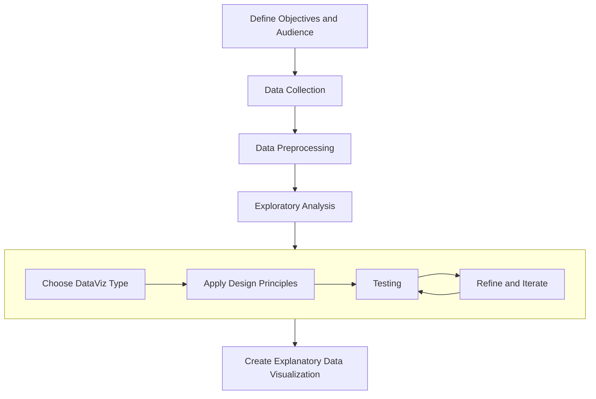

# Week 1
## Introduction to Data Visualization
10/31/2023

<Credit />
---

# Agenda

## Intro + Lecture (45 min)
- What is data visualization?
- Importance of data visualization
- Types of data and their visual representations
## Demo (50 min)
- Observable account setup
- Observable basics
- Create the first notebook!
## Working Session (45 min)

<!-- The first class is about answering some big picture questions - what to expect from the class, what data visualization is and why it matters. We will be spending a good chuck of time setting up the tool we will be using throughout the course. -->


---
layout: image-right
image: 'https://m.media-amazon.com/images/I/81ud7Ri9kFL._SY522_.jpg'
---

# What Is Data Visualization

<quote v-click> The visual display of quantitative information — Edward Tufte</quote> 
<br/>
<br/>
<div v-click>Common data visualizations include tables, charts, graphs, and dashboards.</div> 

<!-- Quoting the title of ET's first published book on dataviz. This is a very influential book in the field, it's regarded one of the cornerstone books on dataviz. This book studies the historic data visualizations, critiques dataviz published by the press, and distills guidelines and principles of making good data graphics. ET's background was in Political Science, Statistics, and Computer Science and he taught at Yale and Princeton. He has a science background, yet he devotes the majority of his book discussing graphical excellence. This is also why this book is so interesting, his emphasis on a high design standard on something was not a popular problem in the design community before. He said design is not about decoration, the fact that it looks good is not a luxuary it's a necessity, it helps the perception of the data. In this class, I will be frequently referencing the theories and examples from his book. -->

---

# Why Visualize Data

<v-clicks>

- Discover and analyze patterns and trends
- Make data-driven/evidence-based decision
- Make complex data more accessible and digestible to their audience
- Explore, analyze, and communicate patterns and insights 

</v-clicks>


---
layout: iframe
url: https://www.youtube.com/embed/jbkSRLYSojo?si=OIwbNKIzT1jLtOqg
---

<!-- Show, don't tell. A 4 minute video by BBC.  -->

---
layout: quote
---

"Data is wildly more powerful when it is both easy to understand and engaging to the public."

### More from Hans Rosling

- [Hans Rosling famous Ted Talks](https://www.ted.com/speakers/hans_rosling)
- [Gapminder interactive data explorer](https://www.gapminder.org/tools/#$chart-type=bubbles&url=v1)

<!-- Hans Rosling in the video showed the audience how effective Data Visualization can be as a communication tool if done correctly. He was a Swedish physician, academic and public speaker. He was a professor of international healthand the co-founder and chairman of the Gapminder Foundation. Global trends in health and economics come to vivid life in his bubble charts.  -->

---

#  Who Uses Data Visualization

- Data Scientists
- Analysts - Business, Financial, Healthcare, Sports
- Economists
- Government & Policy Makers
- Journalists
- Educators
- Marketers
- Researchers - Academics, UX

<v-click>

- Everyone!

</v-click>


---
layout: fact
---

"Without data, you're just another person with an opinion."

— W. Edwards Deming

<!-- William Edwards Deming was an American business theorist, composer, economist, industrial engineer, management consultant, statistician, and writer. -->

---
layout: fact
---


> Source: Dave Campbell’s model of information refinement. Infographics: The Power of Visual Storytelling by Ross Crooks, Josh Ritchie, Jason Lankow

<!-- 

We live in a world that is inundated with data. The ability to refine, process and analyze data shapes our understanding of the world. Data visualization is the tool that transforms data into information and insights. 
-->


---
layout: fact
---

"The ability to take data—to be able to understand it, to process it, to extract value from it, to visualize it, to communicate it—that’s going to be a hugely important skill in the next decades."

— Google’s Chief Economist Dr. Hal R.Varian


---

##  Examples

- [538 projects (ABC news)](https://projects.fivethirtyeight.com/)
- [CNN Visualizing the Israel-Hamas war](https://www.cnn.com/2023/10/10/world/map-israel-hamas-war-dg/index.html)
- [The opioid epidemic](https://chapter55.digital.mass.gov/) 
- [Mike Bostock @ NYT](https://www.nytimes.com/by/mike-bostock) 
- Barbie vs Oppenheimer

<!-- 
Michael Bostock is an American computer scientist and data visualization specialist. He is one of the co-creators of Observable and a key developer of D3.js, a JavaScript library used to produce dynamic, interactive data visualizations for web browsers. 

Chapter 55 Data Report (>100 pages, technical, scientific, automation)
Chapter 55 Data Story (accessible reading level, multimedia, interactive, creative process)
Why data story —> our goal is data to information into insights -->

---

# Data Analysis
<br/>

## Exploratory
- Exploratory data analysis (EDA) is the process of reviewing new data to discover patterns, to spot anomalies, to test hypotheses, and to check assumptions.


## Explanatory
- We also use data visualization to transform raw data into something compelling for an external audience.

---
layout: fact
---

## Data Visualization Process



<!-- Data are raw facts, objective, but the way we collect data, process data and present data can be subjective and biased. Data visualization are convincing, but they can also distort information in the attempts to do so. As consumers of data graphics, equip ourselves with data literacy skills can strenghthen our judgements of the quantitative evidence, and develop our own insights. -->


---
layout: section
---

# Types of Data

---
layout: two-cols
---

## Qualitative

<v-clicks>

- Data that approximates or characterizes, also known as categorical or non-numeric data.
- Often obtained through interviews, surveys, focus groups, documents, etc.
- Examples include:
  - name
  - gender (male, female, nonbinary)
  - observations (e.g., the food was salty)

</v-clicks>

::right::

## Quantitative

<v-clicks>

- Data that is measurable and expressed as a number, also known as numerical data.
- Often gathered using metrics, tests, experiments, instruments with a ratings scale, etc.
- Examples include: 
  - cost
  - number of students
  - weight

</v-clicks>

---
layout: section
---

## Types of Qualitative Data


---
layout: two-cols
---

## Nominal Data

<v-clicks>

- Category data with no inherent order or ranking

Examples include:
- Types of fruits (e.g., apples, bananas, oranges).
- Colors (e.g., red, blue, green).
- Marital status (e.g., single, married, divorced).
- Binary data (e.g., yes/no, true/false)

</v-clicks>

::right::

## Ordinal

- Category data with a meaningful order or ranking

<v-clicks>

- Data that can take any value and usually changes over time

Examples include:
- Education levels (e.g., high school, bachelor's, master's).
- Survey responses with Likert scales (e.g., strongly disagree, disagree, neutral, agree, strongly agree).
- Socioeconomic status (e.g., low, medium, high)

</v-clicks>

---
layout: section
---

## Types of Quantitative Data


---
layout: two-cols
---

## Discrete

<v-clicks>

- Data that can only take certain values

Examples include:
  - the cost of a BMW 7-series
  - your shoe size
  - number of people enrolled in this course

</v-clicks>

::right::

## Continuous

<v-clicks>

- Data that can take any value and usually changes over time

Examples include:
  - the speed of a car during the morning commute
  - your weight
  - the time your cat wakes up each day

</v-clicks>

---
layout: section
---

# Structured data

Structured data is organized and formatted in a way that is easily understandable by both humans and machines. It follows a predefined structure or schema that allows for clear organization and presentation of data. 

---
layout: section
---
# Exercise 
[survey responses](https://docs.google.com/forms/d/1DPSLJ9Kq6GbVBsQkyhqxri6x0v4otgaXg1CdhFfHWL8/edit#responses)

<!-- 
Pie Charts are ideal for giving the reader a quick idea of the proportional distribution of the data.

Bar Chart uses either horizontal or vertical bars (column chart) to show discrete, numerical comparisons across categories. 
 -->

---
layout: section
---

# Demo

---

# Observable
- All-in-one-place: code, data and visualization, running environment
- Open-source: Leverage common coding languages and open-source libraries, most flexible, always have access to your creations, works are transparent, free

- Notebook: web-based interactive canvases where you can combine data, code, and interaction
- Cell: content blocks - add content in **Markdown**, **JavaScript**, SQL, or HTML.

[Set up an account](https://observablehq.com/)

---

# Markdown

- [My First Notebook](https://observablehq.com/d/425164bd033d021d)
- [Markdown Cheatsheet](https://observablehq.com/d/5fad9ce5a1234c52)


---

# Javascript

- [Javascript Data Basics](https://observablehq.com/d/2dc5f3fdd2d0c5c5)


---

# JSON (JavaScript Object Notation)

JavaScript Object Notation - a subset of JavaScript object literal notation. It consists of key-value pairs, where keys are strings, and values can be strings, numbers, objects, arrays, booleans, or null.

```json
{ // JSON object
  "name": "John",
  "age": 30,
  "city": "New York"
}
```
<v-click>
```ts
var person1 = { // javascript object
  name: "John",
  age: 30,
  city: "New York"
}
```
</v-click>

<!-- JSON is a data interchange format often used for data transmission between systems and is based on a subset of JavaScript object notation. JSON is highly prevalent and often the default choice for data interchange, especially in web and API contexts. -->

Other data formats: XML (eXtensible Markup Language), CSV (Comma-Separated Values), SQL (Structured Query Language), etc.