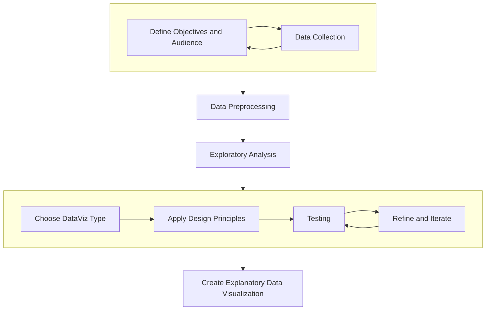

# Week 1
## Introduction to Data Visualization
10/31/2023

<Credit />
---

# Agenda

## Intro + Lecture (45 min)
- What is data visualization?
- Importance of data visualization
- Types of data and their visual representations
## Demo (50 min)
- Observable account setup
- Observable basics
- Create the first notebook!
## Working Session (30 min)

<!-- Today is about answering some big picture questions - what to expect from the class, what data visualization is and why it matters. We will be spending a good chuck of time setting up the tool we will be using throughout the course. -->

---
layout: image-right
image: 'https://m.media-amazon.com/images/I/81ud7Ri9kFL._SY522_.jpg'
---

# What Is Data Visualization

<quote v-click> The visual display of quantitative information</quote> 

<!-- Quoting the title of ET's first published book on dataviz. This is a very influential book in the field, it's regarded one of the cornerstone books on dataviz. This book studies the historical data visualizations, critiques dataviz published by the press, and he's really good at distilling guidelines and principles of making good data graphics from his collection of examples. ET's background was in Political Science, Statistics, and Computer Science and he taught at Yale and Princeton. He has a science background, yet he devotes the majority of his book discussing graphical excellence. This is also why this book is so interesting, his emphasis on a high design standard on something was not a popular problem in the design community before. He said design is not about decoration, the fact that it looks good is not a luxuary it's a necessity, it helps the perception of the data. In this class, I will be frequently referencing the theories and examples from his book, especially when we get to design principles.-->

---
layout: section
---

## Why Visualize Data

<v-clicks>

- Reveal patterns and trends
- Make complex data more accessible and digestible to their audience
- Empower data-driven/evidence-based decision making

</v-clicks>

<!-- 
that might otherwise be hidden in vast amounts of data
Make data more understandable to a broader audience. Empower individuals and communities with data that's accessible will them make informed decisions and advocate for changes.-->

---
layout: iframe
url: https://www.youtube.com/embed/jbkSRLYSojo?si=OIwbNKIzT1jLtOqg
---

<!-- In the spirit of show, don't tell. A 5 minute video by BBC.  -->

---
layout: quote
---

### More from Hans Rosling

- [Hans Rosling famous Ted Talks](https://www.ted.com/speakers/hans_rosling)
- [Gapminder interactive data explorer](https://www.gapminder.org/tools/#$chart-type=bubbles&url=v1)

<!-- Hans Rosling was a Swedish physician, academic and public speaker. In this video, he showed the audience how effective Data Visualization can be as a communication tool. He's famous for his Tedtalks on global trends in health and economics and his animated bubble charts - link to TedTalks.  He co-founded the Gapminder Foundation - an NGO that use data and visualizations to provide information on social-economic and environmental trends and promotes sustainable global development. -->

---

#  Who are the users

- Data Scientists
- Analysts - Business, Financial, Healthcare, Sports
- Economists
- Government & Policy Makers
- Journalists
- Educators
- Marketers
- Researchers - Academics, UX
- Data Artists

<!-- We are all data citizens - we all are actively engage with the data-driven world we live in. A good degree of data literacy can shape our understanding world and get closer to the truth. -->

---
layout: fact
---

## [Visualizing the Israel-Hamas war (CNN)](https://www.cnn.com/2023/10/10/world/map-israel-hamas-war-dg/index.html)
<small>Across the Middle East, Gaza is among the smallest and most densely-packed cities.</small>

<small><a href="http://www.demographia.com/db-worldua.pdf">Source: Demographia World Urban Areas, 2023</a></small>

<!-- 
Airstrikes in Gaza have displaced hundreds of thousands of people leaving them with little room to go.
Visuals are more memorable than text alone. People tend to retain information presented visually for a longer time.
Imagine you are onnly looking at the raw data, or just a table of these data points - the source data are in a long tabular view of the highly populous citites in the world. You are not likely to recall the specific numbers of people per sqare mile across these cities, but the visual will have a long-lasting effect on your brain. 
-->

---
layout: fact
---

"Without data, you're just another person with an opinion."

— W. Edwards Deming

<!-- 
Data journalism has become increasingly important in an era of big data. It not only allows journalists to uncover interesting stories, but also provide it to the audience in a convincing and compelling way. 
-->

---
layout: fact
---

## [The Massachusetts Opioid Epidemic](https://chapter55.digital.mass.gov/)
 

<!-- 

part of a multi-faceted effort to combat the epidemic, chapter 55 was signed into law that permitted the analysis of different government datasets to guide policy decisions and to better understand the opioid epidemic in MA. This groundbreaking data sharing and analysis effort involved 29 groups from government, higher education, and the private sector provided information and expertise.

Chapter 55 Data Report (>100 pages, technical, scientific report)
Chapter 55 Data Story (accessible reading level, multimedia, interactive, creative process)
translate complex data into visuals that everyone can understand
Why data story —> our goal is transform data to information into insights 
You are adding power to data when it is both easy to understand and engaging to the public. 
-->

---
layout: fact
---

| | |
| -------- | ------- |
|   |     |

<!-- 
summary dataviz - simple but impactful.

More than two-thirds of people who died from an opioid-related overdose had a legal opioid prescription at some point from 2011–2014. However, only about 1 in 12 of those who died had an opioid prescription in the month before their death.
many people overdosed kept using opioids illegally after their prescriptions ran out.

Why data story —> our goal is data to information into insights 
You are adding power to data when it is both easy to understand and engaging to the public. 
-->

---
layout: fact
---

## [Front Row to Fashion Week (NYT)](https://www.nytimes.com/newsgraphics/2014/02/14/fashion-week-editors-picks/index.html)

<!-- 
Onto something more light-hearted - Mike Bostock took photographs from the hundreds of fall collections shown during New York Fashion Week.

Color is an important part of the ideas and trends that emerge during Fashion Week. Each runway collection is broken into a minimal stack of color bars, then combined to abstract the collection’s hues. Interesting technique abtract color palettes using pixels.
-->

---
layout: quote
---

### More from Mike Bostock

- [NYT Dataviz work by Mike Bostock](https://www.nytimes.com/by/mike-bostock)
- [Mike Bostock Generative Art on Observable](https://observablehq.com/@mbostock/altered-world)

<!-- 
Michael Bostock He has been a data visualization specialist for the NYT. He is an American computer scientist - is one of the co-creators of Observable and a key developer of D3.js, a JavaScript library used to produce dynamic, interactive data visualizations for web browsers. A lot of the Javascript based dataviz libraries are based upon D3.
-->

---
layout: iframe
url: https://www.youtube.com/embed/ystkKXzt9Wk?si=5VtC6-GkTAUT1VyC
---

<!-- Paths of air traffic over North America visualized in color and form - Aaron Koblin - FAA data was parsed and plotted using the Processing programming. 

Artist, designer, programmer, and entrepreneur specializing in data and digital technologies.
He talked about the flight data art and data art he created using crowd-sourced data. Very interesting if you are into a data arts.-->

---
layout: quote
---

### More from Aaron Koblin

- [Aaron Koblin: Artfully visualizing our humanity](https://www.youtube.com/watch?v=4v4XxlfVk3o)
- [Aaron Koblin projects](http://www.aaronkoblin.com/)

<!-- 
Aaron created and led the Data Arts Team at Google from 2008-2015. Aaron has received numerous awards including the Smithsonian Cooper-Hewitt National Design Award for Interaction Design and the National Science Foundation’s award for science visualization. He received an Emmy in 2014, and two of his music video collaborations have been Grammy nominated. In 2010 Aaron was the Abramowitz Artist in Residence at MIT. He received his MFA in Design|Media Arts from UCLA. His work is part of the permanent collection of the Museum of Modern Art (MoMA) in New York, the Victoria & Albert Museum (V&A) in London, and the Centre Pompidou in Paris. His projects have been shown at international festivals including TED, Sundance, Tribeca Film Festival, Ars Electronica, SIGGRAPH, the Japan Media Arts Festival, and more. -->

---
layout: center
---

> Source: Dave Campbell’s model of information refinement. Infographics: The Power of Visual Storytelling by Ross Crooks, Josh Ritchie, Jason Lankow

<!-- 
The goal of Data visualization to transform data into information and insights. 
-->

---
layout: fact
---

"We are dealing with data systems that are larger than anything that humans have ever built or experienced before."

— Jer Thorp, Data Artist

<v-click>

"The ability to take data—to be able to understand it, to process it, to extract value from it, to visualize it, to communicate it—that’s going to be a hugely important skill in the next decades."

— Dr. Hal R.Varian, Google’s Chief Economist 

</v-click>

---
layout: fact
---

## How? 

---

# Data Analysis
 

## Exploratory
- Exploratory data analysis (EDA) is the process of reviewing new data to discover patterns, to spot anomalies, to test hypotheses, and to check assumptions.

## Explanatory
- We also use data visualization to transform raw data into something compelling for an external audience.

---
layout: fact
---

## Data Visualization Process

<!-- Data are raw facts, objective, but the way we collect data, process data and present data can be subjective and biased. Data visualization are convincing, but they can also distort information in the attempts to do so. As consumers of data graphics, equip ourselves with data literacy skills can strenghthen our judgements of the quantitative evidence, and develop our own insights. -->

---
layout: section
---

# Types of Data

---
layout: two-cols
---

## Qualitative

<v-clicks>

- Data that approximates or characterizes, also known as categorical or non-numeric data.
- Often obtained through interviews, surveys, focus groups, documents, etc.
- Examples include:
  - name
  - gender (male, female, nonbinary)
  - observations (e.g., the food was salty)

</v-clicks>

::right::

## Quantitative

<v-clicks>

- Data that is measurable and expressed as a number, also known as numerical data.
- Often gathered using metrics, tests, experiments, instruments with a ratings scale, etc.
- Examples include: 
  - cost
  - number of students
  - weight

</v-clicks>

---
layout: section
---

## Types of Qualitative Data

---
layout: two-cols
---

## Nominal Data

<v-clicks>

- Categories with no inherent order or ranking

Examples include:
- Types of fruits (e.g., apples, bananas, oranges).
- Colors (e.g., red, blue, green).
- Marital status (e.g., single, married, divorced).
- Binary data (e.g., yes/no, true/false)

</v-clicks>

::right::

## Ordinal

<v-clicks>

- Categories with a meaningful order or ranking

Examples include:
- Education levels (e.g., high school, bachelor's, master's).
- Survey responses with Likert scales (e.g., strongly disagree, disagree, neutral, agree, strongly agree).
- Socioeconomic status (e.g., low, medium, high)

</v-clicks>

<!-- no meaningful way to perform mathematical operations on these categories. -->

---
layout: section
---

## Types of Quantitative Data

---
layout: two-cols
---

## Discrete

<v-clicks>

- Distinct values or categories that can be counted and enumerated

Examples include:
  - shoe sizes
  - number of people enrolled in this course

</v-clicks>

::right::

## Continuous

<v-clicks>

- Measurements that can take on any value within a given range. It can be divided into smaller and smaller units without limit

Examples include:
  - the speed of a car during the morning commute
  - Time intervals
  - Temperature
  - Weight and Height

</v-clicks>

<!-- can be measured with a high degree of precision -->

---
layout: fact
---

<v-click>

</v-click>

> Rap lyrics text mining

<!-- Data Types Recap 
We didn't talk about textual data, is also a common type of qualitative data.
If your data is text-based, usually you would use text mining techniques to analyze the text and extract quantitative information. For example, This is setiment wordcloud is generated from hundreds of famous rap song lyrics through text mining (counting word use frequency) and sentiment analysis (sentiment analysis can assign numerical scores to sentiment in text data). https://github.com/fpaupier/RapLyrics-Scraper/tree/master/lyrics_US

While qualitative and quantitative are mutually exclusive data types, you can provide insights into the qualitative data by conducting 
Frequency Counts, Ordinal Encoding (assign numerical values to categories, yes/no = 1/0) so that you can provide summary statitics and percentage distribution to a qualitative dataset.
-->

---
layout: fact
---

<!-- Data Types Recap DataViz

While qualitative and quantitative are mutually exclusive data types, you can use several methods to create summary statistics or quantitative representations that provide insights into the qualitative data. Here are some common techniques:
Frequency Counts, Percentage Distribution, Ordinal Encoding (assign numerical values to categories, yes/no = 1/0)

These are some commonly used dataviz types to present these types of data, for example.
Understanding the data types will help you select the right data visualizations, and later map to different visual dimensions. More on the data visualization types next week. 
-->

---
layout: section
---
# Exercise 
[survey responses](https://docs.google.com/forms/d/1DPSLJ9Kq6GbVBsQkyhqxri6x0v4otgaXg1CdhFfHWL8/edit#responses)

<!-- 
Pie Charts are ideal for giving the reader a quick idea of the proportional distribution of the data.

Bar Chart uses either horizontal or vertical bars (column chart) to show discrete, numerical comparisons across categories. 
 -->

---
layout: section
---

# Demo

---
layout: section
---

## Observable

<v-clicks>

- [Set up an account](https://observablehq.com/)
- [My First Notebook](https://observablehq.com/d/425164bd033d021d)
- [Markdown Cheatsheet](https://observablehq.com/d/5fad9ce5a1234c52)
- [Javascript Data Basics](https://observablehq.com/d/2dc5f3fdd2d0c5c5)

</v-clicks>

<!-- - All-in-one-place: code, data and visualization, running environment
- Open-source: Leverage common coding languages and open-source libraries, most flexible, always have access to your creations, works are transparent, free

- Notebook: web-based interactive canvases where you can remix data, code, and interaction
- Cell: content blocks - add content in **Markdown**, **JavaScript**, SQL, or HTML. -->

---

## Mentioned Resources:

- [Hans Rosling famous Ted Talks](https://www.ted.com/speakers/hans_rosling)
- [Gapminder interactive data explorer](https://www.gapminder.org/tools/#$chart-type=bubbles&url=v1)
- [Visualizing the Israel-Hamas war (CNN)](https://www.cnn.com/2023/10/10/world/map-israel-hamas-war-dg/index.html)
- [The Massachusetts Opioid Epidemic](https://chapter55.digital.mass.gov/)
- [Front Row to Fashion Week (NYT)](https://www.nytimes.com/newsgraphics/2014/02/14/fashion-week-editors-picks/index.html)
- [NYT Dataviz work by Mike Bostock](https://www.nytimes.com/by/mike-bostock)
- [Mike Bostock Generative Art on Observable](https://observablehq.com/@mbostock/altered-world)
- [Aaron Koblin: Artfully visualizing our humanity](https://www.youtube.com/watch?v=4v4XxlfVk3o)
- [Aaron Koblin projects](http://www.aaronkoblin.com/)
- [Rap lyrics text mining](https://www.kaggle.com/code/rikdifos/rap-lyrics-text-mining)

---

